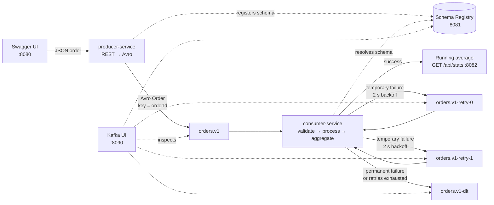
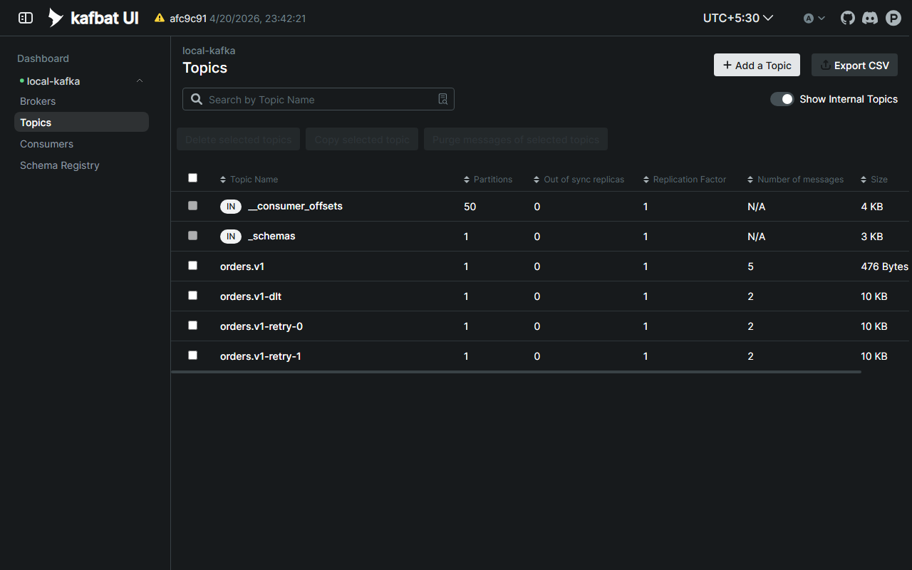
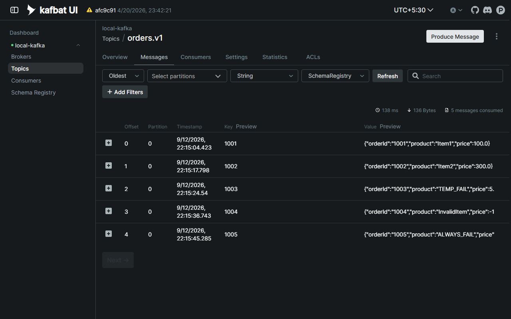
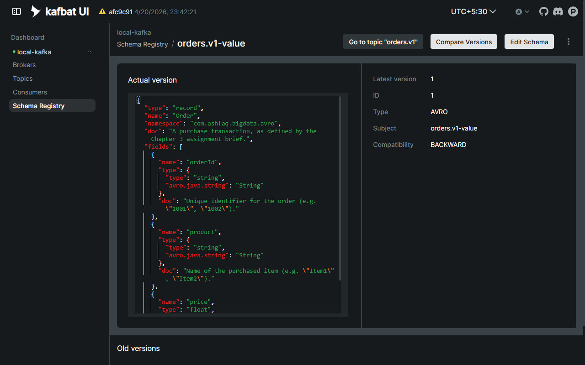
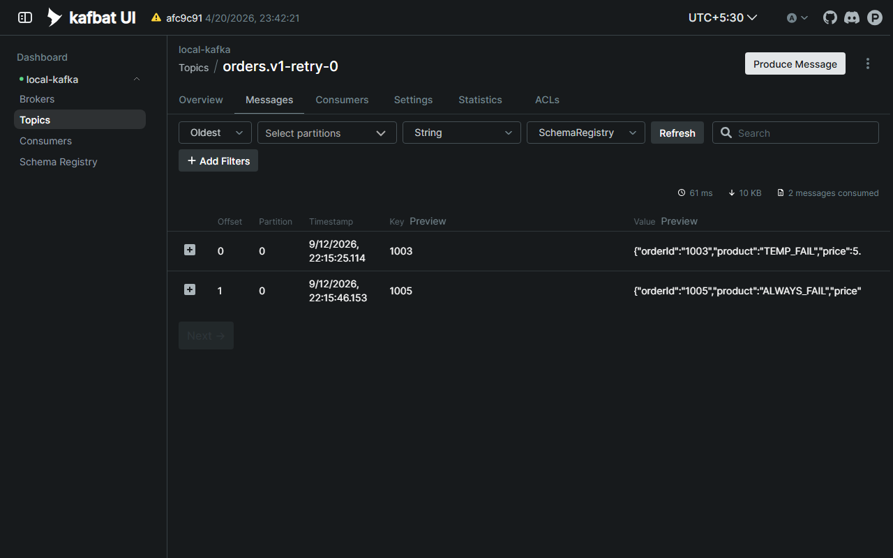
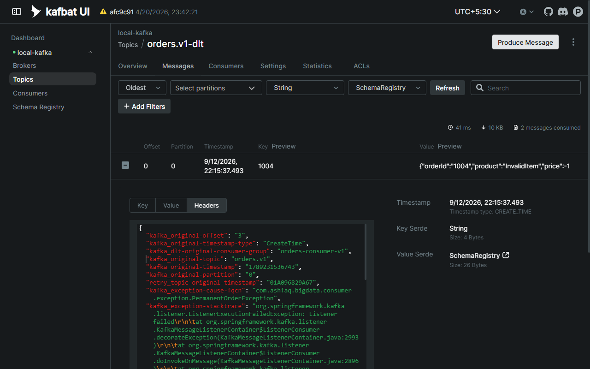
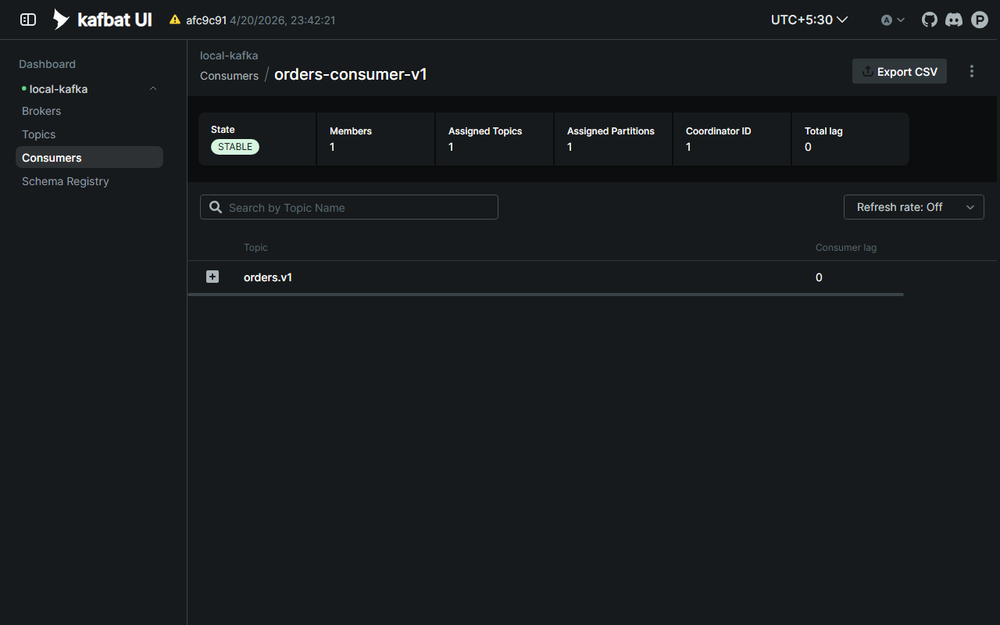
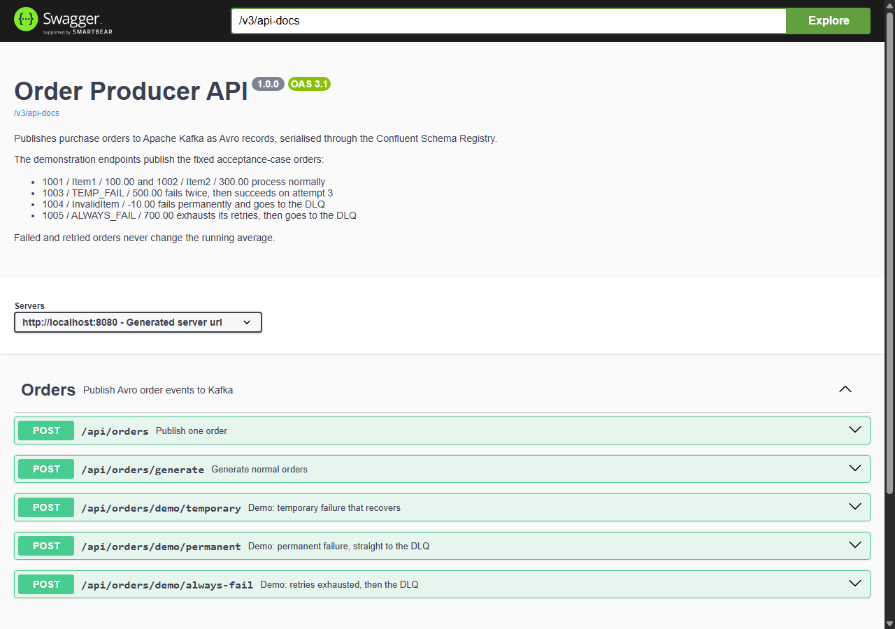

# Real-Time Order Analytics and Failure Handling with Apache Kafka

An event-driven order processing system built on Apache Kafka. A producer service accepts purchase
orders over REST, serialises each one with Avro through the Confluent Schema Registry, and publishes
it to Kafka. A consumer service deserialises the order, processes it, and maintains a running average
of order prices in real time. Temporary processing failures are retried automatically across dedicated
retry topics with a delay; permanent failures, and temporary failures that exhaust their retries, are
routed to a Dead Letter Queue so no message is silently lost.

Everything runs locally: Kafka, the Schema Registry and a browser UI come up with one Docker Compose
command, and the two services build with the committed Maven Wrapper. The automated test suite
passes with no Docker at all.

---

## Contents

1. [Assignment requirements](#1-assignment-requirements)
2. [Architecture](#2-architecture)
3. [Technology stack](#3-technology-stack)
4. [Prerequisites](#4-prerequisites)
5. [Start the infrastructure](#5-start-the-infrastructure)
6. [Build and run the services](#6-build-and-run-the-services)
7. [Demonstration requests and expected output](#7-demonstration-requests-and-expected-output)
8. [Kafka topics](#8-kafka-topics)
9. [How retry and the Dead Letter Queue work](#9-how-retry-and-the-dead-letter-queue-work)
10. [Running the tests](#10-running-the-tests)
11. [Evidence](#11-evidence)
12. [URLs and ports](#12-urls-and-ports)
13. [Live demonstration](#13-live-demonstration)
14. [Operational notes](#14-operational-notes)
15. [Repository layout](#15-repository-layout)
16. [Submission details](#16-submission-details)

---

## 1. Assignment requirements

| Requirement | How it is met | Where |
| --- | --- | --- |
| Kafka producer and consumer | Two Spring Boot services. The producer exposes REST endpoints and publishes to `orders.v1`; the consumer listens on that topic. | [`producer-service`](producer-service/src/main/java/com/ashfaq/bigdata/producer), [`consumer-service`](consumer-service/src/main/java/com/ashfaq/bigdata/consumer) |
| Avro serialisation | Every message is an Avro `Order` record in the Confluent wire format, registered in and resolved through the Schema Registry. The Java model is generated from the schema at build time and never committed. | [`order.avsc`](common-avro/src/main/avro/order.avsc), [`OrderMapper`](producer-service/src/main/java/com/ashfaq/bigdata/producer/OrderMapper.java) |
| Real-time aggregation (running average of prices) | The consumer maintains `count`, `total` and `runningAverage`, updated **only after** an order is processed successfully, with an idempotency guard so a retried order is counted once. Exposed at `GET /api/stats`. | [`RunningAverage`](consumer-service/src/main/java/com/ashfaq/bigdata/consumer/aggregate/RunningAverage.java), [`StatsController`](consumer-service/src/main/java/com/ashfaq/bigdata/consumer/web/StatsController.java) |
| Retry logic for temporary failures | Non-blocking retry topics: three total attempts with a two-second backoff across `orders.v1-retry-0` and `orders.v1-retry-1`. | [`OrderListener`](consumer-service/src/main/java/com/ashfaq/bigdata/consumer/OrderListener.java) |
| Dead Letter Queue for permanent failures | Permanent errors bypass retry entirely; exhausted temporary errors follow them. The DLQ record keeps the original Avro order and carries the error context as headers. | [`OrderListener`](consumer-service/src/main/java/com/ashfaq/bigdata/consumer/OrderListener.java), [`KafkaPublishingConfig`](consumer-service/src/main/java/com/ashfaq/bigdata/consumer/config/KafkaPublishingConfig.java) |
| Live demonstration | Swagger UI for input, Kafka UI for inspection, structured consumer logs for the result. Recording script in [`docs/video-demo.md`](docs/video-demo.md). | [Section 13](#13-live-demonstration) |
| Git repository | This repository, built up in incremental commits. | — |

The order message is exactly as the brief defines it:

| Field | Type | Description |
| --- | --- | --- |
| `orderId` | string | Unique identifier for the order (e.g. `"1001"`, `"1002"`) |
| `product` | string | Name of the purchased item (e.g. `"Item1"`, `"Item2"`) |
| `price` | float | Price of the product |

---

## 2. Architecture



The design reasoning behind each choice — one partition, post-success aggregation, the retry-topic
naming, the dead-letter serialiser — is written up in [`docs/architecture.md`](docs/architecture.md).

---

## 3. Technology stack

| Component | Version |
| --- | --- |
| Java | 21 |
| Spring Boot / Spring for Apache Kafka | 3.4.2 / 3.3.2 |
| Apache Kafka broker (Confluent image, KRaft mode) | 7.9.9 |
| Confluent Schema Registry (image) | 7.9.9 |
| Confluent Avro serialiser and registry client | 7.9.1 |
| Apache Avro and `avro-maven-plugin` | 1.11.4 |
| Kafka UI ([kafbat](https://github.com/kafbat/kafka-ui)) | v1.5.0 |
| springdoc OpenAPI / Swagger UI | 2.8.4 |
| Maven (via the committed wrapper) | 3.9.9 |
| JUnit 5, AssertJ, Awaitility, Spring Kafka Test (embedded broker) | managed by Spring Boot |

---

## 4. Prerequisites

- **Java 21** (JDK) on the `PATH`.
- **Docker Desktop** with Docker Compose v2 (`docker compose`, not `docker-compose`).

**Maven is not required.** The Maven Wrapper is committed, so `./mvnw` (or `.\mvnw.cmd` on Windows)
downloads the pinned Maven distribution on first use.

Host ports `8080`, `8081`, `8082`, `8090` and `9092` must be free.

---

## 5. Start the infrastructure

From the repository root:

```bash
docker compose up -d
```

This starts a single-node Kafka broker in KRaft mode (no ZooKeeper), the Schema Registry, Kafka UI,
and a one-shot `kafka-init` job that creates all four topics. Topic auto-creation is disabled on the
broker, so the topics exist only because that job created them.

Confirm the stack is genuinely usable, not merely running:

```bash
./scripts/verify-stack.sh        # bash / Git Bash
.\scripts\verify-stack.ps1       # PowerShell
```

It checks the broker answers, all four topics exist, and the Schema Registry responds, and exits
non-zero if anything is missing. A healthy broker on its own does not mean the topics are there.

---

## 6. Build and run the services

Build the whole project first. The two services depend on `common-avro`, which generates the
`Order` class from the schema, so the reactor must be installed before either service can run:

```bash
./mvnw clean install             # bash / Git Bash
.\mvnw.cmd clean install         # PowerShell
```

Then start the two services in separate terminals:

```bash
java -jar producer-service/target/producer-service-1.0.0.jar
java -jar consumer-service/target/consumer-service-1.0.0.jar
```

The producer is ready when Swagger UI answers at <http://localhost:8080/swagger-ui/index.html>.
The consumer is ready when `GET http://localhost:8082/api/stats` returns
`{"successfulOrders":0,"totalPrice":0.0,"runningAverage":0.0}`.

---

## 7. Demonstration requests and expected output

The failure behaviour is **deterministic, never random**, so the demonstration reproduces exactly.
The consumer keys its rules off the product name and the price:

| Input | Behaviour |
| --- | --- |
| Positive price, any normal product | Processed successfully |
| Product `TEMP_FAIL` | Temporary failure on attempts 1 and 2, success on attempt 3 |
| Price zero or negative | Permanent failure — never retried |
| Product `ALWAYS_FAIL` | Temporary failure on every attempt, so retries are exhausted |

Send these five orders **in order** through Swagger UI (or `curl`). Each one is a single click on a
demo endpoint. The running average is the proof: it must reach 300.00 and then never move.

| # | Request | Order | Expected consumer log | Average |
| ---: | --- | --- | --- | ---: |
| 1 | `POST /api/orders` `{"orderId":"1001","product":"Item1","price":100.0}` | 1001 / Item1 / 100.00 | `[SUCCESS]` | **100.00** |
| 2 | `POST /api/orders` `{"orderId":"1002","product":"Item2","price":300.0}` | 1002 / Item2 / 300.00 | `[SUCCESS]` | **200.00** |
| 3 | `POST /api/orders/demo/temporary` | 1003 / TEMP_FAIL / 500.00 | `[RETRY] attempt=1`, `[RETRY] attempt=2`, `[SUCCESS] attempt=3` | **300.00** |
| 4 | `POST /api/orders/demo/permanent` | 1004 / InvalidItem / −10.00 | `[PERMANENT-ERROR]`, `[DLQ]` — no retry | **300.00** |
| 5 | `POST /api/orders/demo/always-fail` | 1005 / ALWAYS_FAIL / 700.00 | `[RETRY]` ×3, `[DLQ]` | **300.00** |

The same with `curl`:

```bash
curl -X POST http://localhost:8080/api/orders -H 'Content-Type: application/json' \
     -d '{"orderId":"1001","product":"Item1","price":100.0}'
curl -X POST http://localhost:8080/api/orders -H 'Content-Type: application/json' \
     -d '{"orderId":"1002","product":"Item2","price":300.0}'
curl -X POST http://localhost:8080/api/orders/demo/temporary
curl -X POST http://localhost:8080/api/orders/demo/permanent
curl -X POST http://localhost:8080/api/orders/demo/always-fail
curl http://localhost:8082/api/stats
```

Final `GET /api/stats`:

```json
{"successfulOrders": 3, "totalPrice": 900.0, "runningAverage": 300.0}
```

Each demo endpoint accepts an optional `?orderId=` override, so the demonstration can be re-run with
fresh identifiers without resetting the stack. `POST /api/orders/generate?count=5` publishes valid
orders with randomised prices; their identifiers start at 2001 so they never collide with the fixed
cases above.

---

## 8. Kafka topics

All four are created explicitly by `kafka-init` with one partition and replication factor 1. One
partition and one consumer instance make the global running average deterministic.

| Topic | Purpose |
| --- | --- |
| `orders.v1` | Original order events, keyed by `orderId` |
| `orders.v1-retry-0` | First retry, after a 2-second backoff |
| `orders.v1-retry-1` | Second retry, after a further 2-second backoff |
| `orders.v1-dlt` | Dead Letter Queue: permanent failures and exhausted retries |

The Schema Registry holds one subject per topic (`orders.v1-value`, `orders.v1-retry-0-value`, and
so on), all carrying the same `Order` schema.

---

## 9. How retry and the Dead Letter Queue work

**The consumer updates the running average only after an order is processed successfully.** An
order that throws never reaches the aggregate, so failures and retries cannot move it. The
idempotency guard — a set of counted order identifiers, checked and updated in the same lock as the
counter — guarantees that an order which fails twice and then succeeds is counted exactly once.

**Temporary failures** (`TemporaryOrderException`) are retried without blocking the consumer
thread. Spring Kafka's `@RetryableTopic` republishes the failed record to `orders.v1-retry-0`, waits
out the backoff, processes it again, and on a second failure republishes to `orders.v1-retry-1`. Three
total attempts; the backoff is a minimum of two seconds between them.

**Permanent failures** (`PermanentOrderException`, raised for a price at or below zero) are
excluded from retry. The record goes straight to `orders.v1-dlt` without touching either retry topic:
data that is wrong will not become right by waiting.

**The Dead Letter Queue record is the original Avro order**, unchanged, so it stays inspectable and
could be replayed once the cause is fixed. The error context travels as Kafka headers — exception
class, message, original topic, partition and offset — which Kafka UI displays alongside the decoded
value (see the evidence below).

**A poison pill** — bytes on the topic that were never valid Avro — is routed to the DLQ by the
error-handling deserialiser rather than stopping the consumer. The dead-letter publisher delegates
serialisation by value type so it can forward raw bytes as well as Avro orders.

---

## 10. Running the tests

```bash
./mvnw clean verify
```

**No Docker is required.** The integration tests run against an embedded Kafka broker with an
in-memory Schema Registry, so the build passes on any machine with a JDK. 70 tests across the three
modules; about a minute on a laptop.

Stop the two services first if they are running: `clean` cannot delete a jar that a running JVM
holds open, and the build fails before any test runs.

| Layer | What it proves |
| --- | --- |
| Unit — `common-avro` | The schema has exactly the three fields the brief defines; the generated model round-trips through Avro |
| Unit — producer | DTO to Avro mapping; validation, including that a negative price is deliberately **accepted** so the DLQ path can be demonstrated; generated identifiers never collide with the fixed cases |
| Unit — consumer | Every failure rule; the running-average arithmetic; the idempotency guard, including under 32 concurrent threads; the DLQ header decoding |
| Integration — consumer | All five acceptance cases through a real embedded broker: the aggregate reaches 300.00 and stays there, the permanent failure skips both retry topics, the exhausted failure passes through both, and the DLQ record still deserialises to the original order |
| Web — producer | The HTTP contract of every endpoint with Kafka mocked out |

---

## 11. Evidence

Captured from a clean run of the five demonstration cases against the live stack. The consumer log,
with framework noise turned down so each event is a single line:

```text
22:15:16.665 INFO  [RECEIVED] orderId=1001 product=Item1 price=100.00 attempt=1 topic=orders.v1
22:15:16.669 INFO  [SUCCESS] orderId=1001 attempt=1 processed=true
22:15:16.672 INFO  [AVERAGE] count=1 total=100.00 runningAverage=100.00
22:15:22.189 INFO  [RECEIVED] orderId=1002 product=Item2 price=300.00 attempt=1 topic=orders.v1
22:15:22.190 INFO  [SUCCESS] orderId=1002 attempt=1 processed=true
22:15:22.190 INFO  [AVERAGE] count=2 total=400.00 runningAverage=200.00
22:15:24.105 INFO  [RECEIVED] orderId=1003 product=TEMP_FAIL price=500.00 attempt=1 topic=orders.v1
22:15:24.106 WARN  [RETRY] orderId=1003 attempt=1 reason=Transient failure (attempt 1/3)
22:15:27.153 INFO  [RECEIVED] orderId=1003 product=TEMP_FAIL price=500.00 attempt=2 topic=orders.v1-retry-0
22:15:27.154 WARN  [RETRY] orderId=1003 attempt=2 reason=Transient failure (attempt 2/3)
22:15:29.207 INFO  [RECEIVED] orderId=1003 product=TEMP_FAIL price=500.00 attempt=3 topic=orders.v1-retry-1
22:15:29.208 INFO  [SUCCESS] orderId=1003 attempt=3 processed=true
22:15:29.208 INFO  [AVERAGE] count=3 total=900.00 runningAverage=300.00
22:15:36.777 INFO  [RECEIVED] orderId=1004 product=InvalidItem price=-10.00 attempt=1 topic=orders.v1
22:15:36.782 ERROR [PERMANENT-ERROR] orderId=1004 reason=Price must be greater than zero, but was -10.0
22:15:37.975 ERROR [DLQ] orderId=1004 product=InvalidItem price=-10.00 destination=orders.v1-dlt cause=PermanentOrderException reason=Price must be greater than zero, but was -10.0 origin=orders.v1-0@3
22:15:37.975 INFO  [AVERAGE] unchanged at 300.00 - failed orders never enter the aggregate
22:15:45.533 INFO  [RECEIVED] orderId=1005 product=ALWAYS_FAIL price=700.00 attempt=1 topic=orders.v1
22:15:45.535 WARN  [RETRY] orderId=1005 attempt=1 reason=Downstream unavailable (attempt 1/3)
22:15:51.383 INFO  [RECEIVED] orderId=1005 product=ALWAYS_FAIL price=700.00 attempt=2 topic=orders.v1-retry-0
22:15:51.384 WARN  [RETRY] orderId=1005 attempt=2 reason=Downstream unavailable (attempt 2/3)
22:15:53.427 INFO  [RECEIVED] orderId=1005 product=ALWAYS_FAIL price=700.00 attempt=3 topic=orders.v1-retry-1
22:15:53.428 WARN  [RETRY] orderId=1005 attempt=3 reason=Downstream unavailable (attempt 3/3)
22:15:54.143 ERROR [DLQ] orderId=1005 product=ALWAYS_FAIL price=700.00 destination=orders.v1-dlt cause=TemporaryOrderException reason=Downstream unavailable (attempt 3/3) origin=orders.v1-0@4
22:15:54.144 INFO  [AVERAGE] unchanged at 300.00 - failed orders never enter the aggregate
```

The full excerpt and the final `/api/stats` response are in [`docs/evidence/`](docs/evidence).

### Kafka UI

**Topics, with the message counts from that run** — five originals, two on each retry topic, two
dead-lettered:



**`orders.v1` decoded through the Schema Registry serde.** This is the Avro proof: the values are
real Avro records, readable only because Kafka UI resolves the schema by id.



**The registered schema**, subject `orders.v1-value`, version 1:



**`orders.v1-retry-0`** holds exactly the two orders that were retried, 1003 and 1005 — and not 1004:



**`orders.v1-dlt` with the headers of the permanently failed order** — `kafka_original-topic`,
`kafka_original-offset`, and `kafka_exception-cause-fqcn` naming `PermanentOrderException`:



**The consumer group**: stable, one member, partition 0 assigned, lag 0:



### Swagger UI



---

## 12. URLs and ports

| Service | Host port | URL |
| --- | ---: | --- |
| Producer — Swagger UI | 8080 | <http://localhost:8080/swagger-ui/index.html> |
| Producer — OpenAPI document | 8080 | <http://localhost:8080/v3/api-docs> |
| Schema Registry | 8081 | <http://localhost:8081/subjects> |
| Consumer — running average | 8082 | <http://localhost:8082/api/stats> |
| Kafka UI | 8090 | <http://localhost:8090> |
| Kafka broker (from the host) | 9092 | `localhost:9092` |

Every setting is externalised; see [`.env.example`](.env.example) for the full list and the defaults.

---

## 13. Live demonstration

The recording follows the same five cases, using three views: Swagger UI to send, Kafka UI to
inspect, and the consumer terminal to see the result. The full running order with timings is in
[`docs/video-demo.md`](docs/video-demo.md).

| Step | Shown | Proves |
| --- | --- | --- |
| Running stack, Kafka UI overview | Broker online, four topics, empty consumer group | The infrastructure is real |
| `order.avsc` and the registered subject | Schema file and Schema Registry entry | Avro schema is registered and shared |
| Orders 1001 and 1002 via Swagger | `[SUCCESS]` and `[AVERAGE]` 100.00 then 200.00 | Producer, consumer and aggregation |
| The same order in Kafka UI, decoded | Key 1001, readable Avro value | Serialisation is genuinely Avro |
| `TEMP_FAIL` via Swagger | Two `[RETRY]` lines, success on attempt 3, average 300.00; records on both retry topics | Retry logic, counted once |
| Negative price via Swagger | `[PERMANENT-ERROR]`, `[DLQ]`, average unchanged; record and headers in `orders.v1-dlt` | Dead Letter Queue, aggregate protected |
| Consumer group page | Partition 0, current offset, lag 0 | The consumer is tracking progress |
| Repository | README, tests, commit history | Git submission |

**Video:** _link to be added_

---

## 14. Operational notes

- **The running average is in memory.** It resets when the consumer restarts and does not rebuild
  from topic history, because consumed offsets are committed. Keep the consumer running for the
  duration of a demonstration.
- **After `docker compose down -v`, restart both services.** Wiping the stack empties the Schema
  Registry; a producer that is still running keeps its cached schema id and publishes records the
  consumer can no longer resolve.
- **The retry backoff is a minimum**, not an exact interval. Two seconds is the floor; the retry
  listener's poll cycle can add a few seconds on the first hop after it has been idle.
- To reset for a clean run: `docker compose down -v && docker compose up -d`, then restart the two
  services. More commands in [`scripts/demo-commands.md`](scripts/demo-commands.md).

---

## 15. Repository layout

```text
.
├── common-avro/                 order.avsc and the generated Order model
├── producer-service/            REST API → Avro → orders.v1, with Swagger UI
├── consumer-service/            listener, running average, retry, DLQ, /api/stats
├── docker-compose.yml           Kafka (KRaft), Schema Registry, Kafka UI, topic creation
├── scripts/                     verify-stack.sh / .ps1, demo-commands.md
├── docs/
│   ├── architecture.md          design decisions and their reasoning
│   ├── video-demo.md            recording script and preparation checklist
│   ├── screenshots/             Kafka UI and Swagger UI captures
│   └── evidence/                consumer log excerpt and final stats
├── mvnw, mvnw.cmd, .mvn/        Maven Wrapper
└── pom.xml                      parent build
```

---

## 16. Submission details

| | |
| --- | --- |
| **Student** | M.R.M.Ashfaq |
| **Registration number** | EG/2021/4417 |
| **Module** | EC 8202 — Big Data |
| **Assignment** | Assignment 3 (Chapter 3) |

Released under the [MIT License](LICENSE).
