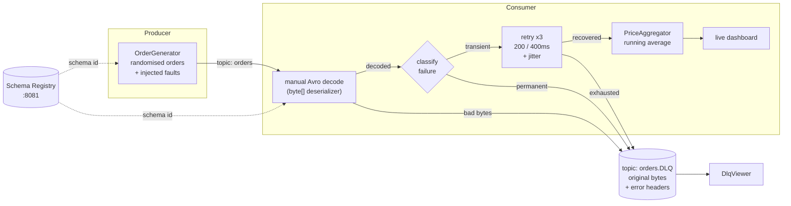

# Kafka Avro Order Pipeline

A Kafka producer/consumer system for **order messages serialised with Avro**, built for the
EC 8202 Big Data Chapter 3 assignment. It performs real-time price aggregation, retries
transient failures with exponential backoff, and routes permanently failed messages to a
dead letter queue.

Written in **Java 17**, running against **Kafka 3.9 (KRaft)** and the **Confluent Schema Registry**,
with the whole stack defined in Docker Compose.

---

## Assignment requirements, and where each one lives

| Requirement | Implementation | Source |
|---|---|---|
| Avro serialisation | Schema registered with the Confluent Schema Registry; messages use the `[magic byte][schema id][payload]` wire format | [`order.avsc`](src/main/avro/order.avsc), [`OrderProducer`](src/main/java/com/assignment/orders/producer/OrderProducer.java) |
| Real-time aggregation (running average of prices) | Welford's online algorithm — lifetime, per-product, and a 60-second sliding window | [`RunningStats`](src/main/java/com/assignment/orders/aggregate/RunningStats.java), [`PriceAggregator`](src/main/java/com/assignment/orders/aggregate/PriceAggregator.java) |
| Retry logic for temporary failures | Exponential backoff with jitter, bounded attempt budget | [`RetryPolicy`](src/main/java/com/assignment/orders/consumer/RetryPolicy.java), [`OrderConsumer`](src/main/java/com/assignment/orders/consumer/OrderConsumer.java) |
| Dead Letter Queue | `orders.DLQ`, carrying the original bytes plus full diagnostic headers | [`DeadLetterPublisher`](src/main/java/com/assignment/orders/dlq/DeadLetterPublisher.java), [`DlqViewer`](src/main/java/com/assignment/orders/dlq/DlqViewer.java) |
| Live demonstration | Scripted, single-command demo with a live terminal dashboard | [`scripts/demo.ps1`](scripts/demo.ps1), [`docs/DEMO_SCRIPT.md`](docs/DEMO_SCRIPT.md) |
| Git repository | Staged commit history, one commit per milestone | this repository |

The design reasoning behind each choice is written up in **[docs/REPORT.md](docs/REPORT.md)**.

---

## The message

Exactly as specified in the brief ([`src/main/avro/order.avsc`](src/main/avro/order.avsc)):

| Field | Type | Description |
|---|---|---|
| `orderId` | string | Unique identifier for the order (e.g. `"1001"`, `"1002"`) |
| `product` | string | Name of the purchased item (e.g. `"Item1"`, `"Item2"`) |
| `price` | float | Price of the product (randomised) |

`Order.java` is **generated from this schema at build time**, so the schema is the single source
of truth and generated code is never committed.

---

## Architecture



### The three failure classes

The system distinguishes failures that are worth retrying from failures that are not. Retrying
a negative price accomplishes nothing except stalling the partition behind it.

| Class | Example | Handling | DLQ reason |
|---|---|---|---|
| **Transient** | downstream gateway timeout | retry up to 3 times with backoff | `RETRIES_EXHAUSTED` (only if all attempts fail) |
| **Permanent** | negative price, blank `orderId` | no retry, dead-letter immediately | `VALIDATION_FAILED` |
| **Poison** | bytes that are not valid Avro | no retry, dead-letter immediately | `DESERIALIZATION_FAILED` |

---

## Prerequisites

- **Docker Desktop** — running before you start
- **JDK 17 or newer** — `java -version` should report 17+
- **Maven is not required.** The Maven Wrapper (`mvnw`) downloads it automatically on first build.

> **Note on `JAVA_HOME`:** the build scripts locate a valid JDK themselves and set `JAVA_HOME`
> for their own session, so a stale or missing `JAVA_HOME` will not break the build.

---

## Quickstart

```powershell
# Everything at once: starts Kafka, builds, and opens the consumer and producer windows.
.\scripts\demo.ps1
```

Or step by step:

```powershell
.\scripts\up.ps1              # start Kafka + Schema Registry + Kafka UI, wait until healthy
.\scripts\build.ps1           # generate Order.java, compile, run tests, build the jar

# ...then in two separate terminals:
.\scripts\run-consumer.ps1    # terminal A: live dashboard
.\scripts\run-producer.ps1    # terminal B: order stream

.\scripts\run-dlq-viewer.ps1  # terminal C: inspect failed messages
.\scripts\down.ps1            # stop everything
```

| Service | URL |
|---|---|
| Kafka broker | `localhost:9092` |
| Schema Registry | <http://localhost:8081> |
| Kafka UI | <http://localhost:8080> |

---

## What you will see

The consumer renders a live panel that repaints four times a second:

```
  ==============================================================================
  KAFKA AVRO ORDER PIPELINE                                          up 00:02:14
  ==============================================================================
  localhost:9092  |  topic orders  |  group order-processor  |  dlq orders.DLQ

  RUNNING AVERAGE PRICE
  ------------------------------------------------------------------------------
         251.83   lifetime        last 60s     248.10   7.9/s
   aggregated 1,043      min      5.31   max    499.62   std dev   142.77

  AVERAGE BY PRODUCT
  ------------------------------------------------------------------------------
   Item1    ####################..  263.41  n=178
   Item2    ##################....  241.02  n=169
   ...

  RELIABILITY
  ------------------------------------------------------------------------------
   consumed 1,204  processed 1,043  retried 118  recovered 79 (81%)
   dead-lettered 43   validation 24  poison 12  exhausted 7  other 0

  RECENT EVENTS
  ------------------------------------------------------------------------------
   20:14:07  RETRY     order 1187 attempt 1/3 failed, retrying in 214ms - ...
   20:14:07  RECOVERED order 1187 succeeded on attempt 2/3
   20:14:09  DLQ       offset 903 -> DLQ [validation] after 1 attempt - price ...
```

The **lifetime** average converges and then barely moves; the **last 60s** figure reacts
immediately. Both are shown because only the second one really demonstrates *real-time*
aggregation.

---

## Configuration

Every setting is an environment variable with a sensible default. The run scripts expose the
common ones as parameters.

### Connection

| Variable | Default | Meaning |
|---|---|---|
| `KAFKA_BOOTSTRAP_SERVERS` | `localhost:9092` | Broker address |
| `SCHEMA_REGISTRY_URL` | `http://localhost:8081` | Schema Registry address |
| `ORDERS_TOPIC` | `orders` | Main topic |
| `DLQ_TOPIC` | `orders.DLQ` | Dead letter queue topic |
| `CONSUMER_GROUP` | `order-processor` | Consumer group id |

### Producer

| Variable | Default | Meaning |
|---|---|---|
| `PRODUCE_RATE_PER_SEC` | `8.0` | Target send rate |
| `TOTAL_MESSAGES` | `0` | Messages to send; `0` streams until Ctrl+C |
| `PRODUCT_COUNT` | `6` | Distinct products (`Item1`..`ItemN`) |
| `MIN_PRICE` / `MAX_PRICE` | `5.0` / `500.0` | Price range |
| `BAD_RECORD_RATE` | `0.08` | Fraction of orders violating a business rule |
| `POISON_RATE` | `0.04` | Fraction published as non-Avro bytes |

### Consumer

| Variable | Default | Meaning |
|---|---|---|
| `TRANSIENT_FAILURE_RATE` | `0.15` | Probability of a simulated downstream outage |
| `MAX_ATTEMPTS` | `3` | Attempts per record, including the first |
| `INITIAL_BACKOFF_MS` | `200` | Delay before the first retry |
| `BACKOFF_MULTIPLIER` | `2.0` | Growth factor per attempt |
| `MAX_BACKOFF_MS` | `5000` | Backoff ceiling |
| `JITTER_FACTOR` | `0.2` | Proportional jitter (±20%) |
| `WINDOW_SECONDS` | `60` | Sliding window width |
| `DASHBOARD_ENABLED` | `true` | `false` falls back to plain log lines |
| `RUN_FOR_SECONDS` | `0` | Stop cleanly after N seconds; `0` runs until Ctrl+C |

### Useful combinations

```powershell
# Force every message through its full retry budget and into the DLQ.
.\scripts\run-consumer.ps1 -FailureRate 1.0

# A clean stream with no injected faults, to show the happy path on its own.
.\scripts\run-producer.ps1 -BadRate 0 -PoisonRate 0

# Re-read the whole topic from offset zero under a fresh consumer group.
.\scripts\run-consumer.ps1 -Group replay-1
```

---

## Tests

```powershell
.\mvnw.cmd test
```

74 unit tests, none of which need a running broker — the DLQ publisher is tested against
Kafka's `MockProducer`, and randomness is injected so retry and fault-injection behaviour is
asserted exactly rather than statistically.

| Suite | Covers |
|---|---|
| `RunningStatsTest` | Welford mean/variance, precision at large magnitudes, edge cases |
| `PriceAggregatorTest` | per-product isolation, sliding-window eviction, throughput |
| `ProcessingMetricsTest` | counters, retry success rate, thread safety |
| `RetryPolicyTest` | exponential growth, ceiling, jitter bounds, overflow guard |
| `ErrorClassifierTest` | transient vs permanent, cause unwrapping, DLQ reason mapping |
| `OrderProcessorTest` | validation rules, simulated outages |
| `OrderGeneratorTest` | fault injection, poison-pill framing |
| `DeadLetterPublisherTest` | header stamping, byte-exact payload preservation |

---

## Project layout

```
├── docker/docker-compose.yml   Kafka (KRaft) + Schema Registry + Kafka UI + topic init
├── src/main/avro/order.avsc    the schema; Order.java is generated from it at build time
├── src/main/java/com/assignment/orders/
│   ├── aggregate/              running average, per-product stats, reliability counters
│   ├── config/                 environment-driven configuration
│   ├── consumer/               poll loop, retry policy, error classification, validation
│   ├── dlq/                    dead letter publisher, headers, viewer
│   ├── exception/              transient vs permanent failure signals
│   ├── producer/               order generation with fault injection
│   └── ui/                     live terminal dashboard
├── src/test/java/              unit tests
├── scripts/                    build, stack lifecycle, run, demo
└── docs/                       design report and live-demo runbook
```

---

## Troubleshooting

**`Docker is not running`** — start Docker Desktop and wait until it reports *Running*, then
re-run `.\scripts\up.ps1`.

**The stack never becomes healthy** — inspect the logs:
```powershell
docker compose -f docker/docker-compose.yml logs kafka schema-registry
```

**Ports already in use** — the stack needs `9092`, `8081` and `8080`. Find the offender with
`netstat -ano | findstr "9092"`.

**The dashboard prints escape sequences instead of drawing** — the terminal does not support
ANSI. Use `.\scripts\run-consumer.ps1 -NoDashboard` for plain log output.

**The consumer sees nothing** — it may have already consumed the topic under its group. Either
run the producer again, or replay from the start with a new group:
`.\scripts\run-consumer.ps1 -Group replay-2`.

**Start completely fresh** — `.\scripts\down.ps1 -Purge` deletes the broker volume and every
message with it.
